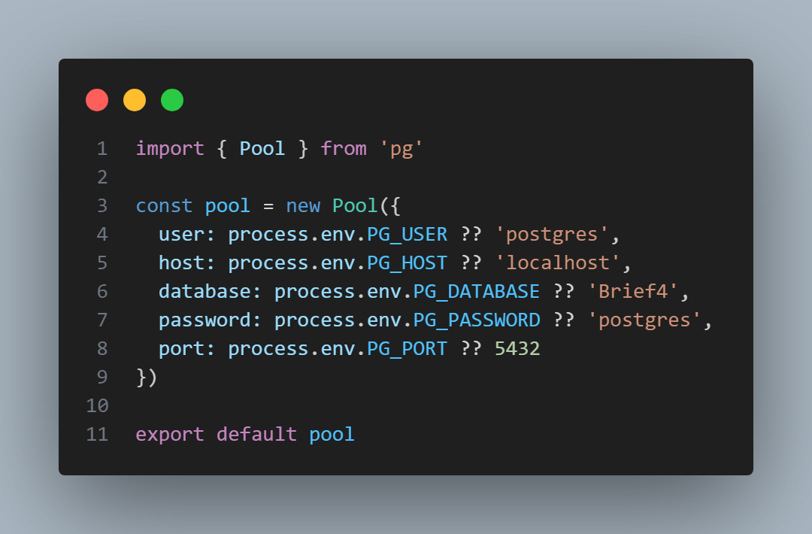
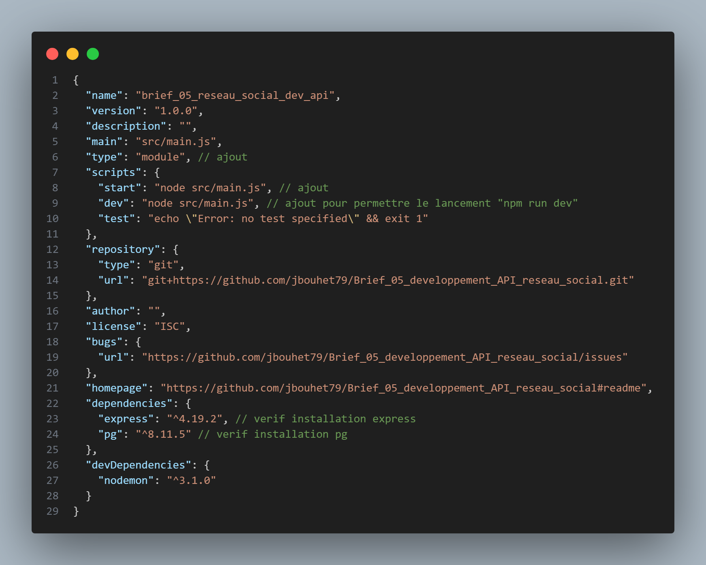

npm init
--> entry point: (index.js) src/main.js

npm i --save express
npm i --save-dev nodemon

==> création des fichiers package.json et package-lock.json

npm i pg
--> installation postgres

Dans src/services/db.js
lien vers la base de données : Brief4

Ajouts dans package.json pourvérifier les installation et permttre le lancement de : npm run dev

npm run dev

